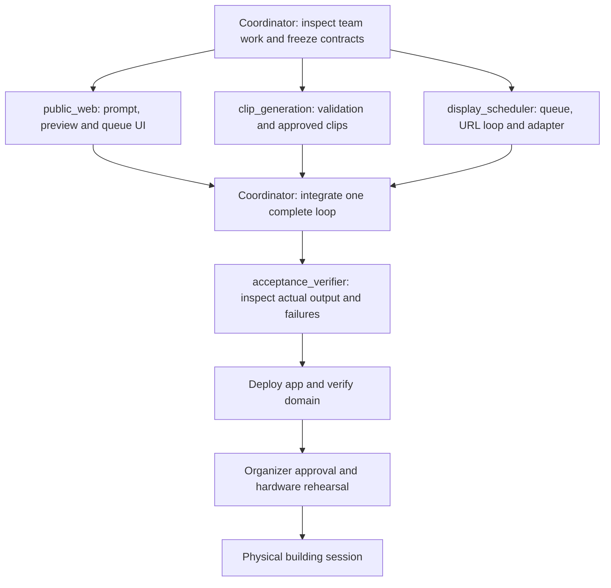

# Hack This Building — Build graph

Draft implementation plan, September 13, 2026. Companion to [the PRD](PRD-hack-this-building.md). Agent work has not been launched; named lanes are proposals for the team to adopt or map to human owners.

## Dependency check

| Step | Reads prior output? | Verdict |
|---|---|---|
| Freeze frame, approved-clip, and queue contracts → component work | Yes | Real edge |
| Website → generation implementation | No; both use the contract | Fake edge; build concurrently |
| Generation implementation → scheduler implementation | No; scheduler can use a known approved fixture | Fake edge; build concurrently |
| All components → full integration | Yes | Real edge |
| Integration → deployment verification | Yes | Real edge |
| PRD drafting → domain registration | No | Fake edge; separate work, registration now complete |

Shared writes are the hidden dependency. The coordinator owns shared contracts, package/config files, dependency lockfiles, workflow files, README, and integration changes. Component lanes own only their directories. Only the scheduler writes frames to the display. Use isolated branches/worktrees when multiple people or agents build simultaneously; do not let every lane edit the project manifest.

## Proposed execution graph

## Graph specification

| Field | Specification |
|---|---|
| GOAL | Deliver one verified public prompt-to-simulator loop at the project domain. |
| FAN OUT | Three independent component lanes after contracts and a working simulator connection are established. |
| CONTRACT | Each lane returns `status`, `changed_files`, `interfaces`, `evidence`, `unresolved`, and `commands_run`. Evidence names the executed check and observed result, not just an assurance. |
| ANCHOR | Repo display definitions; authenticated team-instance API docs; known 17 × 9 clip fixture; actual simulator frames and scheduler event timestamps. Unexecuted checks remain unverified. |
| VERIFY | A separate verifier checks exact clip identity/order/timing, then separately checks public UX, content rejection and operator recovery. It observes output and logs rather than repeating the implementer's reasoning. |
| REDUCE | Coordinator merges shared contracts first, component work second; deduplicates findings by requirement ID; orders blockers before follow-ups. No scoring can waive a P0 invariant. |
| CAP | Three workers concurrently plus coordinator; one bounded verifier after integration; no nested agents; one repair pass per failed acceptance item; at most ten findings per worker. |
| REPORT | Component results, P0 acceptance matrix, deployment URL, unresolved issues, and returned/sent worker count. Current agent count: 0/0. |
| HUMAN GATE | Physical transmission is unreachable from the simulator deployment until the organizer approves and the operator supplies the hardware configuration. Domain purchase is complete. Repo publication and domain connection are user-authorized. |
| FROZEN | 17 rows × 9 columns; at most 30 FPS; five-second clips; two full URL passes; exact approved clip is played; no generated code in the controller; one display writer; truthful queue status. |

## Launch plan and ownership

| Proposed agent | Bounded task | Exclusive write ownership |
|---|---|---|
| `public_web` | Mobile prompt, preview, public queue, personal countdown; consume mocked contracts | `web/` |
| `clip_generation` | Prompt checks, isolated rendering, immutable validated clips | `generation/` |
| `display_scheduler` | FIFO admission, reservations, URL timing, persistence and simulator adapter | `scheduler/`, `display/` |
| `acceptance_verifier` | Run full-loop and failure scenarios on the integrated result; return evidence and defects | `qa/`, `docs/acceptance-results.md`; no production edits |
| Coordinator | Inspect Xander's existing work, choose compatible project structure, freeze interfaces, integrate and deploy | Shared contracts, root configuration, deployment files and remaining documentation |

Directory names are a proposed boundary, not a decision about the app framework. Reconcile them with incoming team code before launching. Integrate in order: contracts → renderer/clip service → scheduler/adapter → UI → verifier. Components may be written concurrently despite this merge order.

**First-run cost estimate:** assume 75% of work is parallel (`p = 0.75`) and three component workers (`N = 3`). Amdahl's law gives `1 / (0.25 + 0.75/3) = 2×` speedup, with an absolute ceiling of `4×`. A nominal four-hour serial task might take about two hours before unexpected access or integration delays; this is an estimate, not a measured result. The cap is 5,000 tokens per component worker, 5,000 for verification, and 8,000 for coordination: **28,000 total**, with no nested budgets. Maximum component fan-in is three. All nodes use the session's inherited model/reasoning tier; no overrides are proposed. Dollar cost is unestimated because the session's applicable billing rates are not available.

The requested graph-engineering skill says, “Do not call `spawn_agent` until the user approves, unless their request already explicitly authorized planning and execution together.” This file is the reviewable launch plan; it does not block already authorized local documentation, GitHub publication, or domain work.
